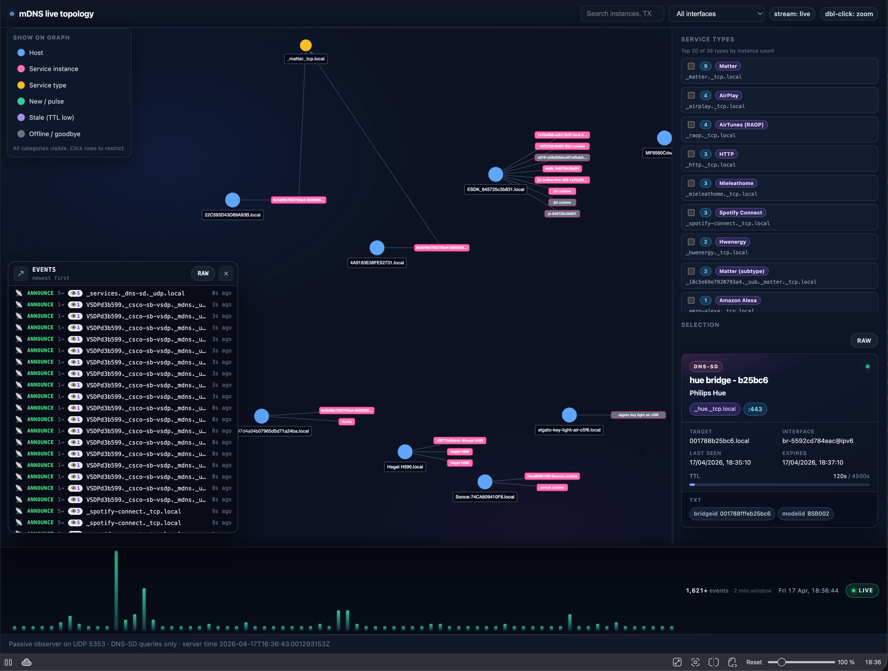
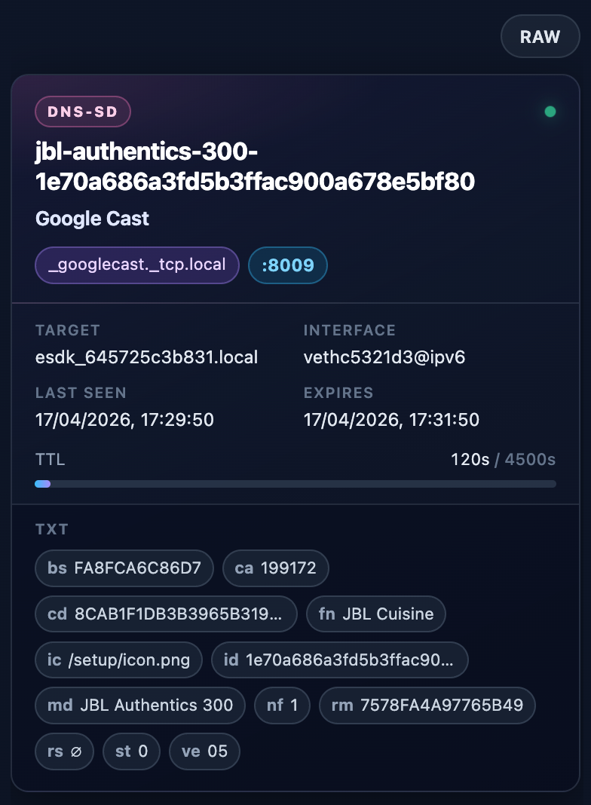
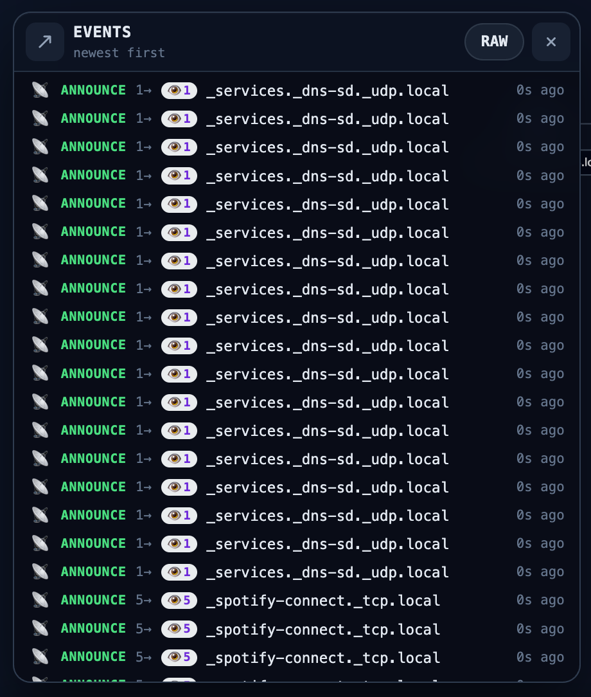

# mDNS Topoviz

**mDNS Topoviz** is a small, self-hosted tool that passively observes **mDNS / DNS-SD** traffic on your LAN and draws a **live graph** of discovered hosts and service instances. It is aimed at homelab operators, network engineers, and developers who want visibility into Zeroconf discovery without pushing configuration to devices.

- Listens on **UDP 5353** (multicast) and parses common record types (`PTR`, `SRV`, `TXT`, `A`, `AAAA`, `NSEC`, …).
- Serves a **local web UI** (React + Cytoscape.js) with filters, selection details, a live event feed, and a simple packet-activity strip.
- **No cloud account, no phone-home telemetry** — data stays on the machine that runs the server.

> **Contract:** this is a **read-only observer** by design. Besides joining multicast and sending **standard DNS-SD discovery queries** on port 5353, it does not perform configuration pushes, port scans, or ARP “attacks”. See [Security & privacy](#security--privacy) before exposing the UI beyond localhost.

## Quick start

### Easiest path: `start.sh` / `stop.sh` / `restart.sh` (Docker)

If you have **Docker** with the **Compose v2** plugin (`docker compose`), the repo root scripts are the quickest way to run the stack defined in [`docker-compose.yml`](./docker-compose.yml) (host networking, UI on **port 8765**).

| Script | What it does |
| --- | --- |
| **`start.sh`** | `docker compose down` (cleans orphans), removes any stray container named `mdns-topoviz`, then **`docker compose up -d --build`**. Builds the image when needed and starts the service in the background. |
| **`stop.sh`** | **`docker compose down`** — stops and removes the compose stack. |
| **`restart.sh`** | Stops the stack, then **`docker compose up -d --build --force-recreate`** — useful after changing `docker-compose.yml`, the Dockerfile, or app code you want picked up in a fresh container. |

From a clone of the repository:

```bash
cd mDNS_Topoviz
chmod +x start.sh stop.sh restart.sh   # only if your checkout is not executable
./start.sh
```

Open **http://127.0.0.1:8765** on the host (or the machine’s LAN IP if you browse from another device). Multicast for mDNS uses **host network mode** in compose, which is what you usually want for discovery.

### Without Docker: build and run the binary

**Requirements:** Go **1.22+**, Node **20+** (only if you build the UI from source), and permission to bind / join multicast (often root, `sudo`, or the right Linux capabilities on `UDP 5353`).

```bash
cd mDNS_Topoviz
make build    # builds web/ and compiles the Go binary
./bin/mdns-topoviz -http :8765
```

For contributors and automation, see **[AGENTS.md](./AGENTS.md)** for repository layout, APIs, and conventions.

## Features

- Multicast listeners on capable interfaces (IPv4 / IPv6 where the OS allows).
- In-memory **ring buffer** of recent discovery events (capacity configurable).
- **REST JSON:** graph snapshot, event history, health.
- **WebSocket** stream for live events (powers the floating event panel in the UI).
- **Docker** image (multi-stage build) for homelab deployment.

Longer-term ideas (packet capture export, durable storage, extra protocols) are **not** part of the default scope; the codebase is structured so they can be added in follow-ups without breaking the read-only posture.

## Screenshots

Drop image files under [`docs/screenshots/`](./docs/screenshots/) (PNG or WebP work well on GitHub). Replace the paths below with your own filenames, or edit the captions to match what you captured.

### Live topology

The main graph: hosts, service instances, and service-type nodes as they appear on your LAN.



### Selection & sidebar

Choosing a host or service instance and inspecting details, TTL, and TXT in the right-hand panel.



### Events (optional)

The floating discovery event feed and filters, if you want to highlight live traffic.



## Configuration

Flags are documented in `--help`. Environment variables override flags for easy containers:

| Variable | Typical use |
| --- | --- |
| `MDNS_TOPOVIZ_HTTP` | Listen address (e.g. `:8765` or `127.0.0.1:8765`) |
| `MDNS_TOPOVIZ_EVENTS` | Max retained events in the ring buffer |
| `MDNS_TOPOVIZ_IFACES` | Comma-separated interface names (empty = auto) |
| `MDNS_TOPOVIZ_QUERY_INTERVAL` | DNS-SD meta-query interval |
| `MDNS_TOPOVIZ_GRACE` | How long to keep offline nodes visible |
| `MDNS_TOPOVIZ_NEW` | Window for highlighting “new” nodes |

Example:

```bash
MDNS_TOPOVIZ_HTTP=:8765 MDNS_TOPOVIZ_IFACES=eth0 ./bin/mdns-topoviz
```

Commented templates: [.env.example](./.env.example).

## Docker

`--network host` (or an equivalent) is usually required so multicast behaves like on the host network namespace. The compose file already uses **`network_mode: host`** for the `topoviz` service.

For day-to-day use, prefer **`./start.sh`**, **`./stop.sh`**, and **`./restart.sh`** (see [Quick start](#quick-start)). One-off run without compose:

```bash
docker build -t mdns-topoviz:local .
docker run --rm --network host mdns-topoviz:local -http :8765
```

## Building from source (details)

| Target | Command |
| --- | --- |
| Full release binary | `make build` — installs npm deps, runs Vite, copies `web/dist/` → `internal/webui/assets/`, then `go build` |
| Web bundle only | `make web` |
| Run after build | `make run` or `./bin/mdns-topoviz` |

A plain `go build` **after** `make web` embeds the SPA via `internal/webui/embed.go`. On a clean tree, run `make web` first so `internal/webui/assets/` is populated.

## Repository layout

```
cmd/mdns-topoviz/     # main()
internal/api/         # HTTP, WebSocket, static files
internal/config/      # flags + env
internal/discovery/   # mDNS parsing + DNS-SD querier
internal/listener/    # multicast UDP
internal/model/       # graph + event ring
internal/graphmerge/  # merge duplicate hosts in snapshots
internal/hostenrich/  # optional read-only enrichment
internal/webui/       # embedded SPA (generated by make web)
web/                  # Vite + React + Cytoscape sources
```

## Security & privacy

- The program observes **broadcast / multicast DNS** on networks you attach it to. Graphs and JSON may include **hostnames, service instance names, TXT keys/values, and addresses**.
- Treat captures, logs, and exports as **sensitive**. Do not publish them without review.
- The UI and API are intended for **trusted local use**. If you bind to non-loopback interfaces, put a reverse proxy or firewall in front for anything beyond a lab.

## Contributing

Issues and pull requests are welcome. Please read **[AGENTS.md](./AGENTS.md)** before larger changes so layout, build steps, and the read-only product contract stay consistent.

## License

MIT — see [LICENSE](./LICENSE).
